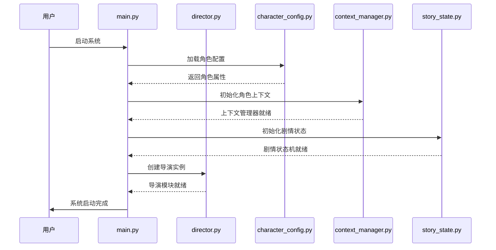
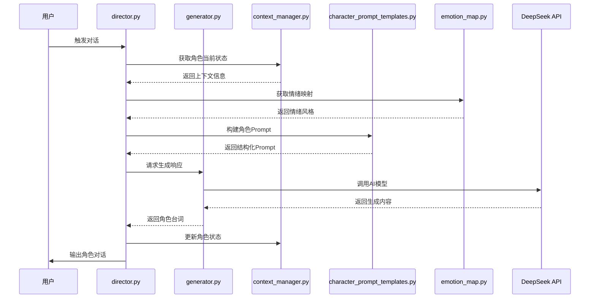
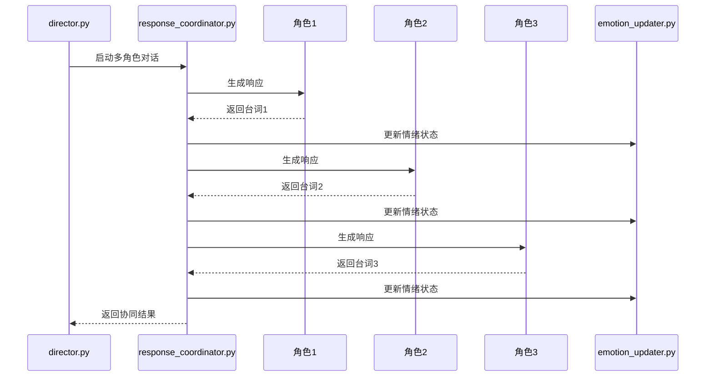
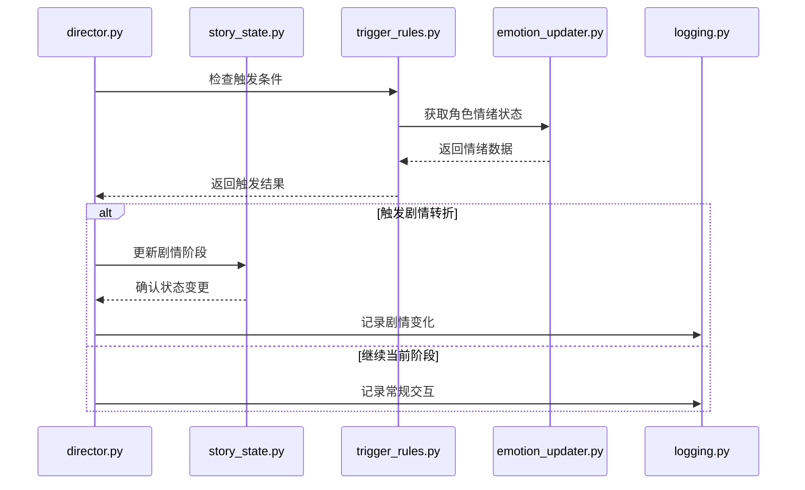
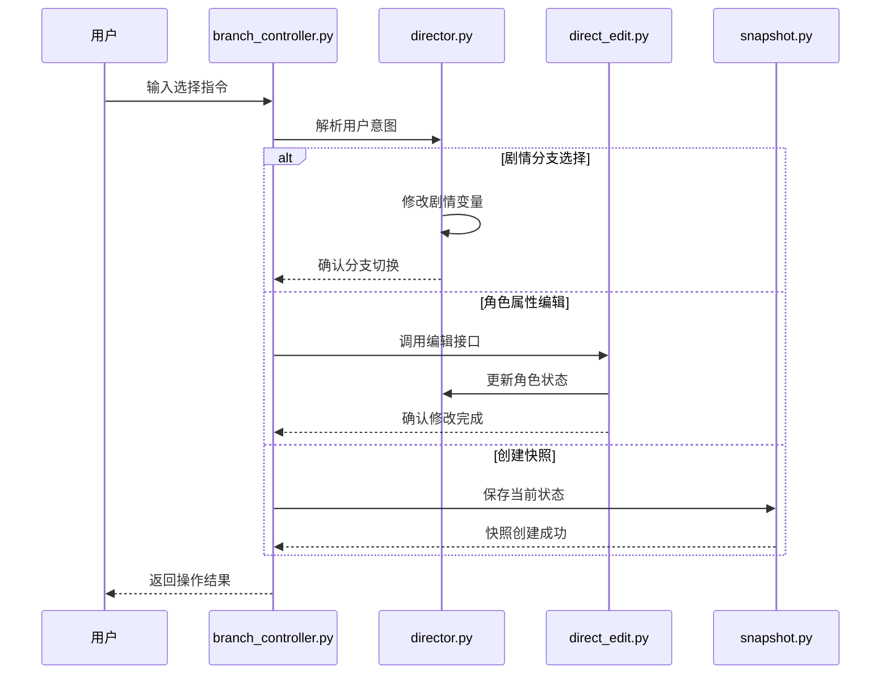
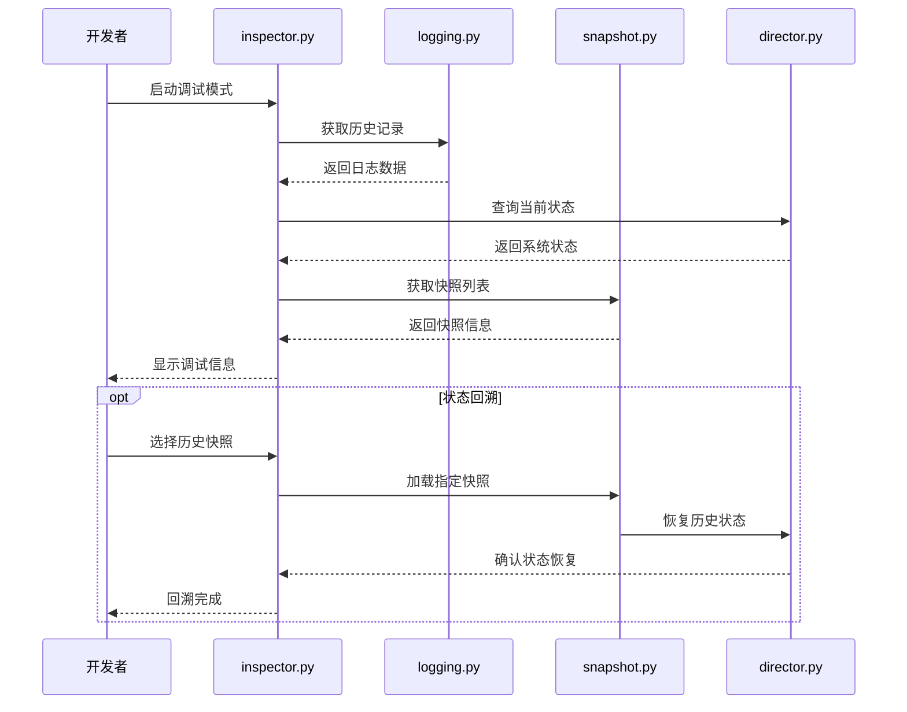

# AI剧本工坊 - 时序图

## 系统启动与初始化流程

```mermaid
sequenceDiagram
    participant User as 用户
    participant Main as main.py
    participant Director as director.py
    participant Config as character_config.py
    participant Context as context_manager.py
    participant Story as story_state.py

    User->>Main: 启动系统
    Main->>Config: 加载角色配置
    Config-->>Main: 返回角色属性
    Main->>Context: 初始化角色上下文
    Context-->>Main: 上下文管理器就绪
    Main->>Story: 初始化剧情状态
    Story-->>Main: 剧情状态机就绪
    Main->>Director: 创建导演实例
    Director-->>Main: 导演模块就绪
    Main->>User: 系统启动完成
```

## 角色对话生成流程

```mermaid
sequenceDiagram
    participant User as 用户
    participant Director as director.py
    participant Generator as generator.py
    participant Context as context_manager.py
    participant Prompt as character_prompt_templates.py
    participant Emotion as emotion_map.py
    participant DeepSeek as DeepSeek API

    User->>Director: 触发对话
    Director->>Context: 获取角色当前状态
    Context-->>Director: 返回上下文信息
    Director->>Emotion: 获取情绪映射
    Emotion-->>Director: 返回情绪风格
    Director->>Prompt: 构建角色Prompt
    Prompt-->>Director: 返回结构化Prompt
    Director->>Generator: 请求生成响应
    Generator->>DeepSeek: 调用AI模型
    DeepSeek-->>Generator: 返回生成内容
    Generator-->>Director: 返回角色台词
    Director->>Context: 更新角色状态
    Director->>User: 输出角色对话
```

## 多角色协同对话流程

```mermaid
sequenceDiagram
    participant Director as director.py
    participant Coordinator as response_coordinator.py
    participant Character1 as 角色1
    participant Character2 as 角色2
    participant Character3 as 角色3
    participant Updater as emotion_updater.py

    Director->>Coordinator: 启动多角色对话
    Coordinator->>Character1: 生成响应
    Character1-->>Coordinator: 返回台词1
    Coordinator->>Updater: 更新情绪状态
    Coordinator->>Character2: 生成响应
    Character2-->>Coordinator: 返回台词2
    Coordinator->>Updater: 更新情绪状态
    Coordinator->>Character3: 生成响应
    Character3-->>Coordinator: 返回台词3
    Coordinator->>Updater: 更新情绪状态
    Coordinator-->>Director: 返回协同结果
```

## 剧情推进与触发机制

```mermaid
sequenceDiagram
    participant Director as director.py
    participant Story as story_state.py
    participant Trigger as trigger_rules.py
    participant Updater as emotion_updater.py
    participant Logger as logging.py

    Director->>Trigger: 检查触发条件
    Trigger->>Updater: 获取角色情绪状态
    Updater-->>Trigger: 返回情绪数据
    Trigger-->>Director: 返回触发结果
    
    alt 触发剧情转折
        Director->>Story: 更新剧情阶段
        Story-->>Director: 确认状态变更
        Director->>Logger: 记录剧情变化
    else 继续当前阶段
        Director->>Logger: 记录常规交互
    end
```

## 用户交互与分支控制

```mermaid
sequenceDiagram
    participant User as 用户
    participant Branch as branch_controller.py
    participant Director as director.py
    participant Edit as direct_edit.py
    participant Snapshot as snapshot.py

    User->>Branch: 输入选择指令
    Branch->>Director: 解析用户意图
    
    alt 剧情分支选择
        Director->>Director: 修改剧情变量
        Director-->>Branch: 确认分支切换
    else 角色属性编辑
        Branch->>Edit: 调用编辑接口
        Edit->>Director: 更新角色状态
        Edit-->>Branch: 确认修改完成
    else 创建快照
        Branch->>Snapshot: 保存当前状态
        Snapshot-->>Branch: 快照创建成功
    end
    
    Branch-->>User: 返回操作结果
```

## 调试与监控流程

```mermaid
sequenceDiagram
    participant Dev as 开发者
    participant Inspector as inspector.py
    participant Logger as logging.py
    participant Snapshot as snapshot.py
    participant Director as director.py

    Dev->>Inspector: 启动调试模式
    Inspector->>Logger: 获取历史记录
    Logger-->>Inspector: 返回日志数据
    Inspector->>Director: 查询当前状态
    Director-->>Inspector: 返回系统状态
    Inspector->>Snapshot: 获取快照列表
    Snapshot-->>Inspector: 返回快照信息
    Inspector-->>Dev: 显示调试信息
    
    opt 状态回溯
        Dev->>Inspector: 选择历史快照
        Inspector->>Snapshot: 加载指定快照
        Snapshot->>Director: 恢复历史状态
        Director-->>Inspector: 确认状态恢复
        Inspector-->>Dev: 回溯完成
    end
```
